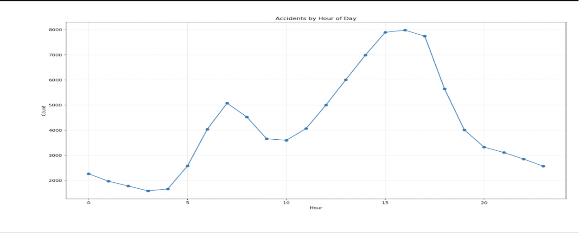
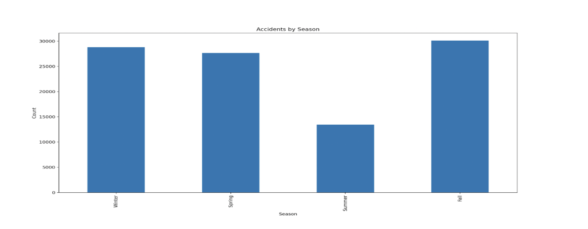
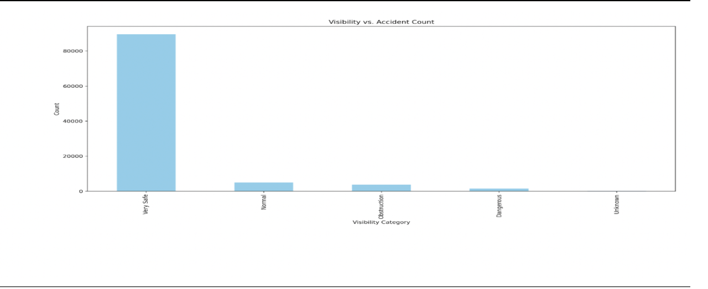
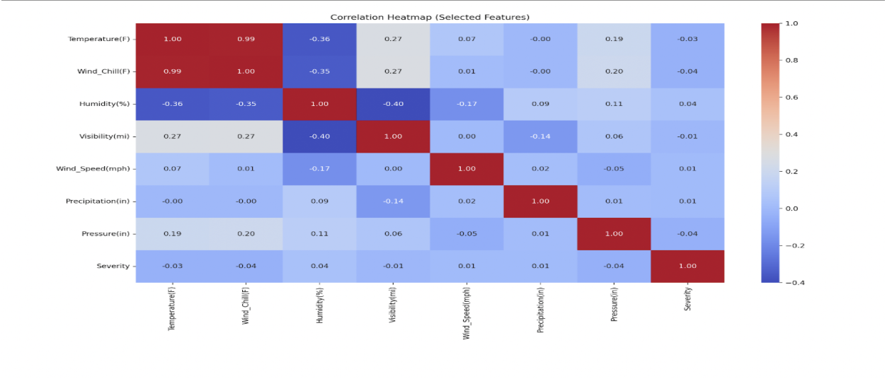
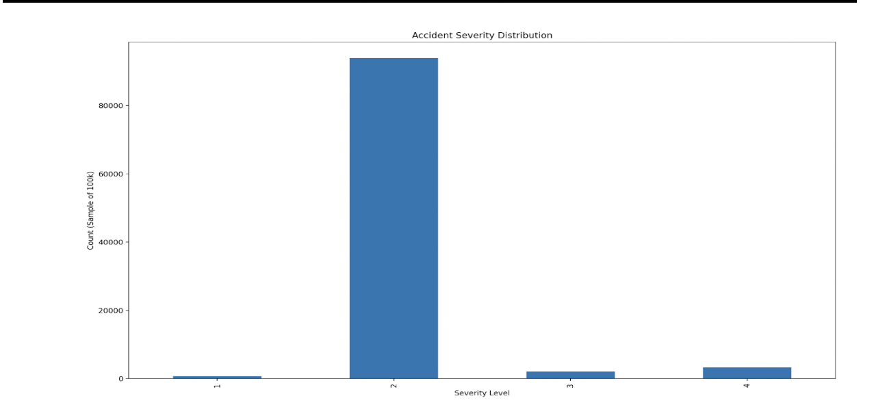
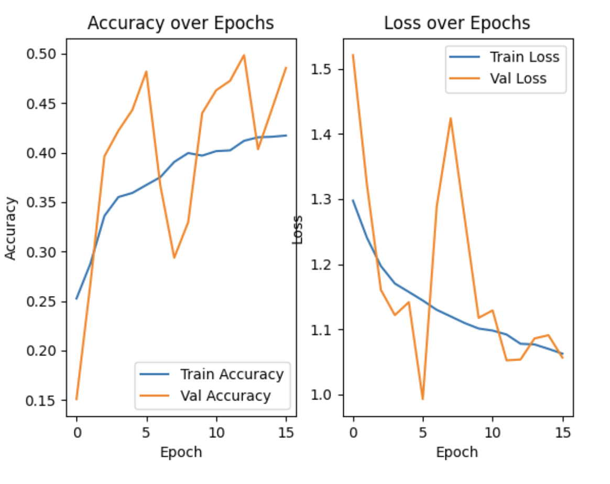

# federal-crash-severity-analytics

### US Traffic Accident Severity Prediction
   - ** A machine learning pipeline that preprocesses U.S. traffic accident data and trains to predict accident severity based on environmental, temporal, and road conditions.

## Overview:
   This project utilizes the US Accidents (March 2023) dataset by Sobhan Moosavi with the size of 7.7 million from Kaggle to clean and preprocess extensive accident data. It involves engineering significant features related to time, weather, and risk, and subsequently training a deep neural network classifier to forecast accident severity. The model’s performance is assessed using accuracy, F1-score, and confusion matrices.

## Features:
   - ** Automated kaggle dataset ingestion with roboust missing-value handling
   - ** Advanced feature engineering
      - **Temporal features
      - **Weather and visibilty risk metrics
      - **Rush hour and Day of week metrics
   - **Multiple scaling approaches
   - **Early stopping and model checkpointing

## Results and Visuals
   - 
     - Accident frequency is highest during the morning and evening commute hours, highlighting the significance of incorporating rush-hour indicators into feature engineering.
   - 
     - Seasonal variations are evident, with a noticeable increase in accidents during the winter and fall months. These accidents are likely influenced by the weather conditions and reduced visibility during these seasons.
   - 
     - Although Lower visibility levels are strongly associated with increased accident rates this accounts for total accident count
   - 
     - Correlation analysis uncovers relationships between weather variables, time-based features, and accident severity, which in turn informs feature selection and engineering decisions.
   - 
     - The target variable is highly imbalanced, with lower severity classes dominating the dataset. This imbalance severely affects classification performance, prompting future research into alternative prediction targets, such as binary risk classification.
   - 
     - Training and validation curves show stable convergence with early stopping, but class imbalance hinders performance on minority severity classes.

## Future Enhancements and Ideas
   - ** Shifting away but not leaving Severity behind
   - ** Use regression models like Gradient Boosting (e.g., XGBoost, LightGBM) or a Deep Neural Network trained with a Mean Absolute Error (MAE) or Mean Squared Error (MSE) loss function.
   - ** Spatial-Temporal Modeling
      ** Using Recurrent Neural Networks (RNNs) or Time-Series Techniques to model the severity as a function of previous events on the same road segment.
   - ** Explainable AI (XAI) for Trust and Deployment
      ** Severity Confidence (%) and Likelihood based on condition(%)
